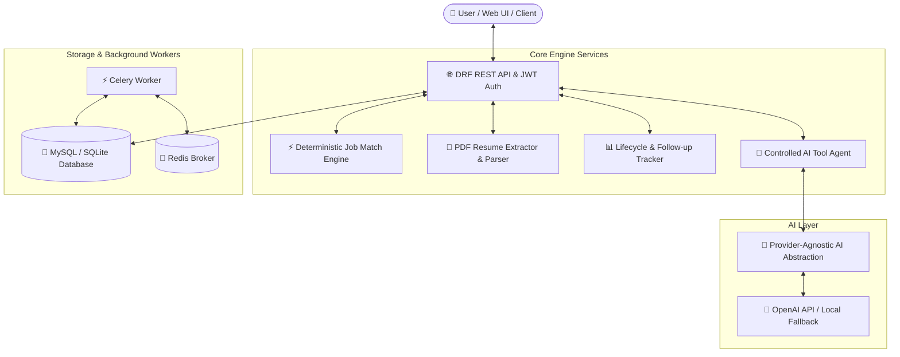
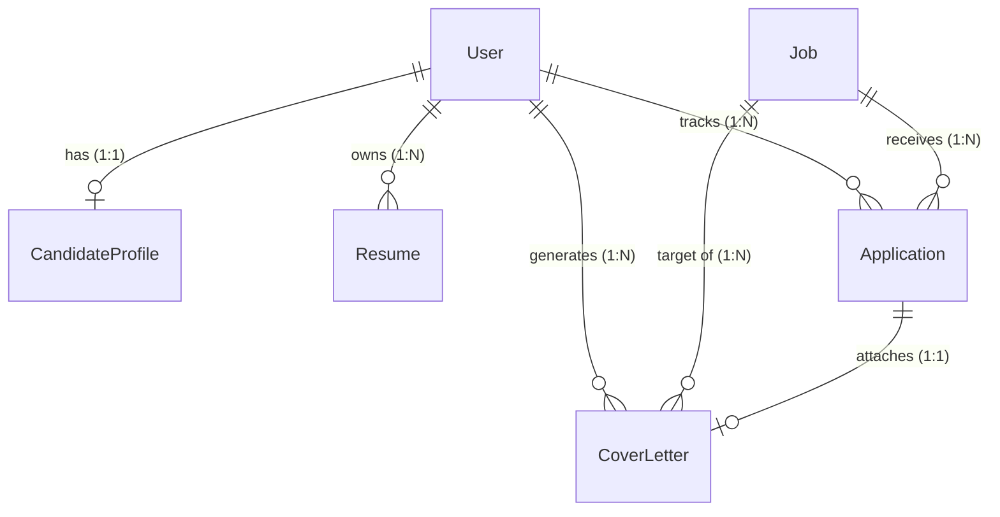

<div align="center">

# 🚀 JobPilot AI
### Autonomous Job Search & Career Application Engine

[](https://python.org)
[](https://djangoproject.com)
[](https://www.django-rest-framework.org/)
[](https://docs.celeryq.dev/)
[](https://redis.io/)
[](https://mysql.com)
[](LICENSE)

<p align="center">
  <b>An enterprise-grade, backend-first career assistant</b> that automates job discovery, evaluates candidates against job specs with a <b>deterministic multi-factor match engine</b>, parses resumes, generates hyper-personalized cover letters, and orchestrates actions via a <b>controlled tool-calling AI agent</b>.
</p>

[Key Features](#-key-features) •
[Architecture](#-system-architecture) •
[Quick Start](#-quick-start--installation) •
[AI Tools](#-controlled-ai-agent-tools) •
[API Specs](#-api-documentation) •
[Documentation](#-deep-dive-documentation)

---
</div>

## 🌟 Overview

**JobPilot AI** solves the core challenges faced by modern job seekers: noise in job search results, opaque matching algorithms, generic resume submissions, and chaotic application tracking. 

Built with **Django 5.1**, **Django REST Framework**, and **Celery**, JobPilot AI combines high-performance backend architecture with LLM provider abstractions and strict safety bounds.

> 🔒 **Human-in-the-Loop Safety**: JobPilot AI preps custom application materials, calculates deterministic fit, and finds external application links, but **final submission remains 100% under user control**.

---

## ✨ Key Features

| Feature | Description |
| :--- | :--- |
| ⚡ **Deterministic Match Engine** | 0–100% composite scoring breakdown across **Skills (50%)**, **Experience (20%)**, **Location (10%)**, **Salary (10%)**, and **Education (10%)** with missing skill gap identification. |
| 🤖 **Controlled Tool-Calling AI Agent** | Secure internal tool runner preventing hallucinated capabilities or unapproved actions through strict tool execution bounds. |
| 📄 **PDF Resume Parsing & ATS Analytics** | Automated text extraction, primary resume enforcement via DB constraints, and rule-based keyword & skill extraction. |
| 🔄 **Extensible Job Ingestion** | Abstracted `JobSource` interface supporting public job APIs, manual imports, and mock sources with strict database deduplication. |
| ✍️ **Hallucination-Free Cover Letters** | Context-aware LLM cover letter generator conditioned strictly on candidate profile data and job specifications. |
| 📊 **Application Lifecycle Tracking** | Track applications across 6 stages (`SAVED`, `APPLIED`, `INTERVIEW`, `REJECTED`, `SELECTED`, `WITHDRAWN`) with real-time analytics. |
| ⏰ **Background Processing & Follow-ups** | Async Celery + Redis workers for PDF extraction, job syncs, and automated follow-up reminders. |

---

## 🏗 System Architecture



### Database Entity Relationship Model



---

## 🛠 Tech Stack

- **Backend**: Python 3.12+, Django 5.1, Django REST Framework (DRF)
- **Authentication**: Simple JWT (JSON Web Tokens)
- **Database**: MySQL 8.0 (Production) / SQLite3 (Zero-config Dev)
- **Async Queue & Broker**: Celery 5.4, Redis 5.0
- **AI & Document Processing**: PyPDF 5.0, OpenAI API (Provider Agnostic `AIService`)
- **API Documentation**: OpenAPI 3.0, `drf-spectacular`, Swagger UI
- **Frontend Dashboard**: HTML5, Vanilla CSS3 (CSS Variables, Flexbox/Grid), JavaScript ES6+

---

## 🚀 Quick Start & Installation

### Prerequisites
- **Python 3.11+** or **3.12+**
- **Git**
- *(Optional)* **Redis Server** (for asynchronous Celery tasks)

### 1. Clone & Set Up Virtual Environment

```bash
# Clone the repository
git clone https://github.com/jahid3145/jobpilot-ai.git
cd "JobPilot AI"

# Create virtual environment
python -m venv venv

# Activate Virtual Environment
# Windows PowerShell:
.\venv\Scripts\Activate.ps1
# Linux / macOS:
source venv/bin/activate
```

### 2. Install Dependencies & Configure Environment

```bash
# Install Python packages
pip install -r requirements.txt

# Create environment configuration file
cp .env.example .env
```

### 3. Database Migration & Demo Data Seeding

```bash
# Run database migrations
python manage.py migrate

# Seed rich demo dataset (Creates candidate, resumes, jobs & sample applications)
python manage.py seed_demo_data
```

### 4. Run Development Server

```bash
python manage.py runserver
```

Navigate to `http://127.0.0.1:8000/` in your browser to launch the Web Dashboard.

---

## 🔑 Demo Credentials

Test the application instantly using pre-configured demo credentials:

| Field | Credential |
| :--- | :--- |
| **Username** | `demo_candidate` |
| **Password** | `DemoPass123!` |

---

## 🤖 Controlled AI Agent Tools

The AI Agent operates strictly within a curated toolbox of 11 deterministic tools to ensure absolute reliability:

| Tool Name | Description |
| :--- | :--- |
| `search_jobs` | Search & filter jobs by title, skills, location, or min salary |
| `get_job_details` | Retrieve full job specification & requirement details |
| `get_candidate_profile` | Fetch candidate preferences, skills, and target roles |
| `get_primary_resume` | Get extracted text & structured data of the primary resume |
| `calculate_job_match` | Compute deterministic 5-factor match score breakdown |
| `explain_job_match` | Generate natural-language breakdown of matching & missing skills |
| `generate_cover_letter` | Draft custom cover letter grounded strictly in candidate profile |
| `save_job` | Bookmark a job listing to candidate profile |
| `create_application` | Log a new application entry with custom target status |
| `update_application_status`| Move application through stages (`SAVED` ➔ `APPLIED` ➔ `INTERVIEW` etc.) |
| `find_follow_up_tasks` | Identify upcoming & overdue application follow-up actions |

---

## ⚡ Background Processing (Celery & Redis)

To enable asynchronous resume parsing, job synchronization, and automated notification processing:

```bash
# Start Celery Worker (in a separate terminal)
celery -A config worker -l info
```

> 💡 **Note**: In local development environments without Redis running, task fallbacks execute synchronously to maintain full functional capabilities seamlessly.

---

## 📖 API Documentation

Interactive API documentation is powered by **OpenAPI 3.0** via `drf-spectacular`:

- **Swagger UI Interface**: `http://127.0.0.1:8000/api/docs/`
- **OpenAPI Schema JSON**: `http://127.0.0.1:8000/api/schema/`
- **System Health Check**: `http://127.0.0.1:8000/api/health/`

### Core Endpoint Summary

| Module | Endpoint | Method | Description |
| :--- | :--- | :--- | :--- |
| **Auth** | `/api/users/register/` | `POST` | User registration |
| **Auth** | `/api/users/token/` | `POST` | Obtain JWT access/refresh tokens |
| **Profile** | `/api/users/profile/` | `GET/PUT` | Candidate profile management |
| **Resumes** | `/api/resumes/` | `GET/POST` | Resume PDF upload & parsing |
| **Jobs** | `/api/jobs/` | `GET` | List & filter jobs with match scores |
| **Jobs** | `/api/jobs/{id}/match/` | `GET` | Calculate detailed 5-factor match |
| **Applications** | `/api/applications/` | `GET/POST` | Manage application lifecycle |
| **AI Agent** | `/api/ai-agent/chat/` | `POST` | Execute controlled tool-calling chat session |

---

## 🧪 Running Tests

Execute the complete Django TestCase & DRF API test suite:

```bash
python manage.py test tests
```

---

## 📚 Deep Dive Documentation

For technical architectural deep dives and interview guides, refer to the project docs:

- 📐 [`docs/architecture.md`](file:///c:/RESUME%20PROJECTS/JobPilot%20AI/docs/architecture.md) — Detailed Architecture & System Design
- 🔌 [`docs/api.md`](file:///c:/RESUME%20PROJECTS/JobPilot%20AI/docs/api.md) — Comprehensive REST API Documentation
- 🤖 [`docs/agent.md`](file:///c:/RESUME%20PROJECTS/JobPilot%20AI/docs/agent.md) — AI Agent Tool Schemas & Safety Rules
- 💼 [`docs/interview.md`](file:///c:/RESUME%20PROJECTS/JobPilot%20AI/docs/interview.md) — System Design & Interview Q&A Guide

---

## 📄 License

Distributed under the **MIT License**. See `LICENSE` for more information.

<div align="center">

---
⭐ **Star this repository if you find JobPilot AI useful!** ⭐

</div>
