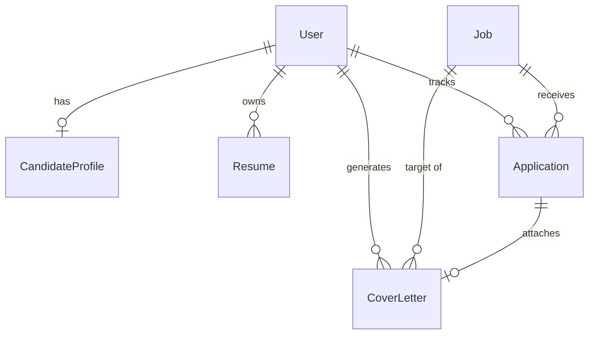

# System Architecture

## System Overview

```text
Browser / API Client ──► DRF Endpoints / Views ──► Business Services ──► SQLite / MySQL
                                 │                        │
                                 │                        ├──► Resume Extractor & Parser
                                 │                        ├──► Deterministic Job Match Engine
                                 │                        └──► Cover Letter & AI Service
                                 ▼
                     Controlled AI Tool Agent ──► Approved Internal Tools
```

Configuration is managed via `config/settings/base.py`, `development.py`, and `production.py`. Database credentials and secrets are loaded from environment variables (`.env`). Local development supports SQLite out-of-the-box, while production environments seamlessly target MySQL.


---

## High-Level Component Design

```text
Client (Web UI / REST API Client)
    │
    ├── Authentication (JWT Simple JWT)
    │
    ├── Candidate Profile & Resume Management
    │      └── Resume Parsing Engine (PDF Text Extraction + Rule/Keyword Analysis)
    │
    ├── Job Management & Ingestion Layer
    │      └── Abstracted JobSource (Mock, Public API, User Import)
    │
    ├── Multi-Factor Job Matching Engine (Deterministic 0-100% Score Breakdown)
    │
    ├── AI Provider Abstraction (AIService Layer -> Local Mock or LLM Provider)
    │
    ├── Controlled Tool-Based AI Agent (Allows only approved internal tool execution)
    │
    └── Async Task Processing (Celery Worker + Redis Broker)
```

The matching service is strictly deterministic, producing explicit breakdown percentages (Skills 50%, Experience 20%, Location 10%, Salary 10%, Education 10%). The AI provider interface handles human-readable explanations and cover letter generation without hallucinating experience.

---

## Django Application Boundaries

- **`apps.users`**: Handles user registration, JWT authentication (`SimpleJWT`), and candidate profiles.
- **`apps.resumes`**: Manages PDF file uploads, extracted text storage, structured skill/experience JSON parsing, and primary resume state.
- **`apps.jobs`**: Manages job postings, search, multi-field filtering (salary, location, skills, experience), duplicate job prevention, and deterministic match score computation.
- **`apps.applications`**: Manages application tracking status (`SAVED`, `APPLIED`, `INTERVIEW`, `REJECTED`, `SELECTED`, `WITHDRAWN`), follow-up dates, and cover letter generation.
- **`apps.notifications`**: Handles pending follow-up task identification and dashboard stats aggregation.
- **`apps.ai_agent`**: Implements the tool-calling AI agent, tool definitions, tool router, and provider abstractions.
- **`apps.web`**: Server-rendered interactive UI dashboard, resume manager, job search view, and assistant UI.

---

## Entity Relationship & Database Constraints



- **Candidate Profile**: 1:1 relationship with `User`.
- **Primary Resume**: Enforced via a `UniqueConstraint(fields=['user'], condition=Q(is_primary=True))` database constraint.
- **Duplicate Applications**: Enforced via a `UniqueConstraint(fields=['user', 'job'])` database constraint.
- **Duplicate Job Ingestion**: Enforced via a `UniqueConstraint(fields=['source', 'external_job_id'])` database constraint.

---

## Background Processing Strategy

Celery tasks (`parse_resume_task`, `sync_jobs_task`, `follow_up_notifications_task`) are configured using Redis as the message broker. In local environments without Redis, tasks execute synchronously so the core workflow remains fully operational.

